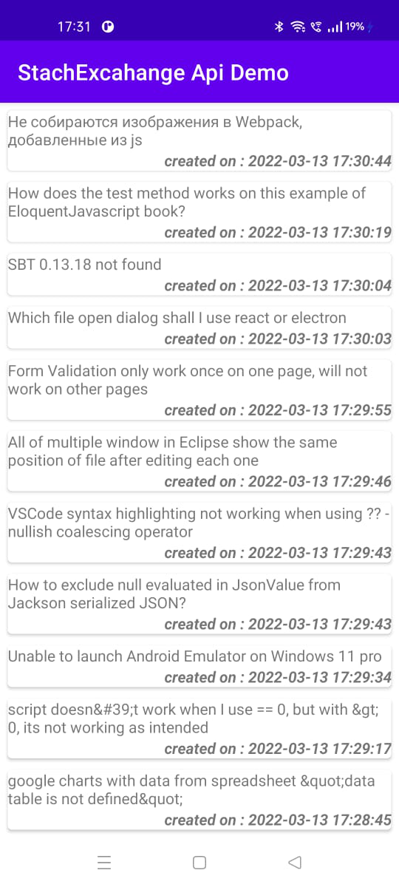
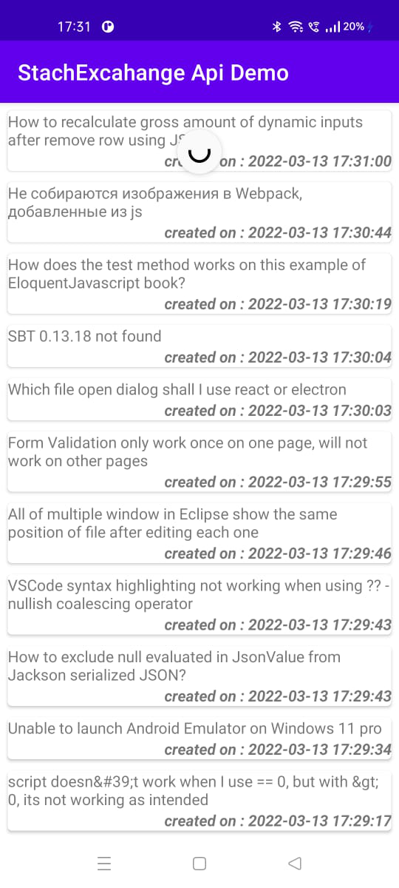

# android-stackexchange-api-demo
A basic application to show list of recently posted questions on stackoverflow

## Main screen
```
This is the main screen which is showing list of recently posted questions which are having answers
```


## Main screen (After swipe down -> Refresh)
```
This is the main screen which is fetching latest set of questions with answers from stack overflow after swiping down
```

